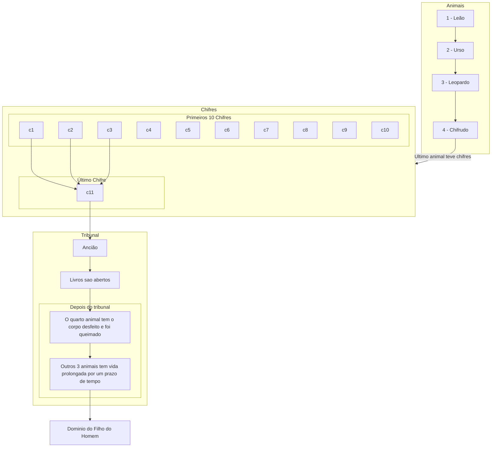
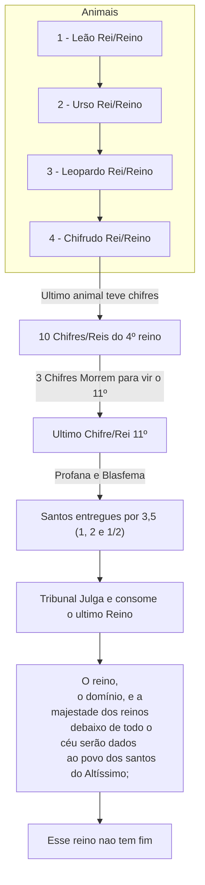

###### Introdução, data de quando ele teve o sonho
1No primeiro ano de Belsazar, rei da Babilônia, teve Daniel um sonho e visões ante seus olhos, quando estava no seu leito; escreveu logo o sonho e relatou a suma de todas as coisas. 

# O Sonho

## Quatro animais
2Falou Daniel e disse: Eu estava olhando, durante a minha visão da noite, e eis que os quatro ventos do céu agitavam o mar Grande. 3Quatro animais, grandes, diferentes uns dos outros, subiam do mar. 
### Primeiro Animal - Leão
4O primeiro era como leão e tinha asas de águia; enquanto eu olhava, foram-lhe arrancadas as asas, foi levantado da terra e posto em dois pés, como homem; e lhe foi dada mente de homem. 

### Segundo Animal - Urso
5Continuei olhando, e eis aqui o segundo animal, semelhante a um urso, o qual se levantou sobre um dos seus lados; na boca, entre os dentes, trazia três costelas; e lhe diziam: Levanta-te, devora muita carne. 

### Terceiro Animal - Leopardo
6Depois disto, continuei olhando, e eis aqui outro, semelhante a um leopardo, e tinha nas costas quatro asas de ave; tinha também este animal quatro cabeças, e foi-lhe dado domínio. 

### Quarto Animal - Terrível e espantoso
7Depois disto, eu continuava olhando nas visões da noite, e eis aqui o quarto animal, terrível, espantoso e sobremodo forte, o qual tinha grandes dentes de ferro; ele devorava, e fazia em pedaços, e pisava aos pés o que sobejava; era diferente de todos os animais que apareceram antes dele e tinha dez chifres.

##  Ultimo Chifre do quarto animal
8Estando eu a observar os chifres, eis que entre eles subiu outro pequeno, diante do qual três dos primeiros chifres foram arrancados; e eis que neste chifre havia olhos, como os de homem, e uma boca que falava com insolência.

## Tronos e o Ancião de Dias com vestes brancas
9Continuei olhando, até que foram postos uns tronos, e o Ancião de Dias se assentou; sua veste era branca como a neve, e os cabelos da cabeça, como a pura lã; o seu trono eram chamas de fogo, e suas rodas eram fogo ardente. 10Um rio de fogo manava e saía de diante dele; milhares de milhares o serviam, e miríades de miríades estavam diante dele; assentou-se o tribunal, e se abriram os livros. 

## Julgamento dos quatro animais
11Então, estive olhando, por causa da voz das insolentes palavras que o chifre proferia; estive olhando e vi que o animal foi morto, e o seu corpo desfeito e entregue para ser queimado. 12Quanto aos outros animais, foi-lhes tirado o domínio; todavia, foi-lhes dada prolongação de vida por um prazo e um tempo. 

## Filho do Homem recebe domínio glória e reino
13Eu estava olhando nas minhas visões da noite, e eis que vinha com as nuvens do céu um como o Filho do Homem, e dirigiu-se ao Ancião de Dias, e o fizeram chegar até ele. 14Foi-lhe dado domínio, e glória, e o reino, para que os povos, nações e homens de todas as línguas o servissem; o seu domínio é domínio eterno, que não passará, e o seu reino jamais será destruído.
###### Daniel fica encabulado
15Quanto a mim, Daniel, o meu espírito foi alarmado dentro de mim, e as visões da minha cabeça me perturbaram. 16Cheguei-me a um dos que estavam perto e lhe pedi a verdade acerca de tudo isto. Assim, ele me disse e me fez saber a interpretação das coisas: 

# A interpretação

## Primeiro é informado um resumo do sonho
17Estes grandes animais, que são quatro, são quatro reis que se levantarão da terra. 18Mas os santos do Altíssimo receberão o reino e o possuirão para todo o sempre, de eternidade em eternidade. 

## Daniel fica interessado no final do sonho
19Então, tive desejo de conhecer a verdade a respeito do quarto animal, que era diferente de todos os outros, muito terrível, cujos dentes eram de ferro, cujas unhas eram de bronze, que devorava, fazia em pedaços e pisava aos pés o que sobejava; 20e também a respeito dos dez chifres que tinha na cabeça e do outro que subiu, diante do qual caíram três, daquele chifre que tinha olhos e uma boca que falava com insolência e parecia mais robusto do que os seus companheiros. 21Eu olhava e eis que este chifre fazia guerra contra os santos e prevalecia contra eles, 22até que veio o Ancião de Dias e fez justiça aos santos do Altíssimo; e veio o tempo em que os santos possuíram o reino.

## Explicação do ultimo animal e as ultimas coisas do sonho
### Sobre o quarto animal
23Então, ele disse: O quarto animal será um quarto reino na terra, o qual será diferente de todos os reinos; e devorará toda a terra, e a pisará aos pés, e a fará em pedaços. 
### Sobre os 10 chifres o ultimo chifre e o reinado dos santos
24Os dez chifres correspondem a dez reis que se levantarão daquele mesmo reino; e, depois deles, se levantará outro, o qual será diferente dos primeiros, e abaterá a três reis. 25Proferirá palavras contra o Altíssimo, magoará os santos do Altíssimo e cuidará em mudar os tempos e a lei; e os santos lhe serão entregues nas mãos, por um tempo, dois tempos e metade de um tempo. 26Mas, depois, se assentará o tribunal para lhe tirar o domínio, para o destruir e o consumir até ao fim. 

27O reino, e o domínio, e a majestade dos reinos debaixo de todo o céu serão dados ao povo dos santos do Altíssimo; o seu reino será reino eterno, e todos os domínios o servirão e lhe obedecerão. 

28Aqui, terminou o assunto. Quanto a mim, Daniel, os meus pensamentos muito me perturbaram, e o meu rosto se empalideceu; mas guardei estas coisas no coração.