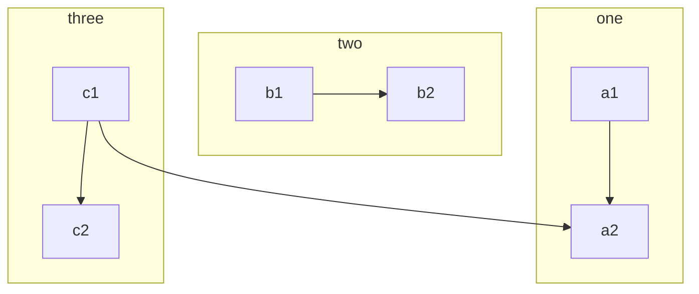
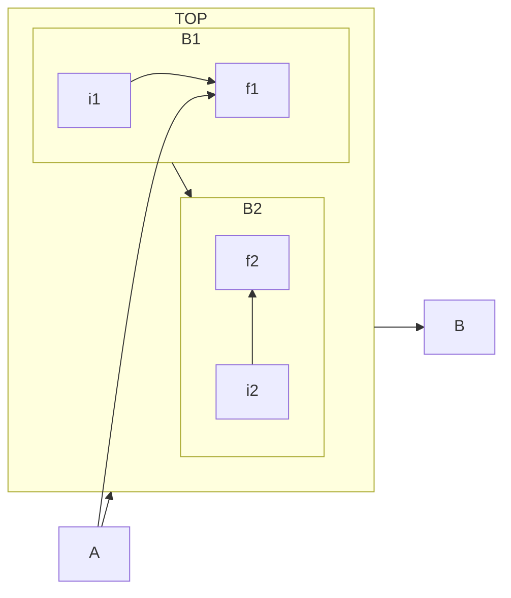
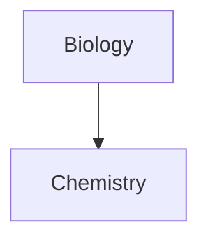

## [Mermaid Documentation](https://mermaid.js.org/syntax/flowchart.html)


### FlowChart

```
flowchart TB
    c1-->a2
    subgraph one
    a1-->a2
    end
    subgraph two
    b1-->b2
    end
    subgraph three
    c1-->c2
    end
```



---

```
flowchart LR
  subgraph TOP
    direction TB
    subgraph B1
        direction RL
        i1 -->f1
    end
    subgraph B2
        direction BT
        i2 -->f2
    end
  end
  A --> TOP --> B
  B1 --> B2
  A --> f1
```



---
```
graph TD 
Biology --> Chemistry 
class Biology,Chemistry internal-link;
```



