```mermaid
gantt
    title Reino Ptolomaico
    dateFormat SSS
    axisFormat %

	section Alexandre
		Alexandre: 323, 332
    section Dinastia Ptolomaica
        Ptolomeu I Sóter : 283,305
        Ptolomeu II Filadelfo : 246,283
        Ptolomeu III Evérgeta : 221,246
	    Ptolemeu IV Filópator: 205,221
	    Ptolomeu V Epifanio: 180, 205
	    Cleopatra I: 180, 193
	    Ptolemeu VI Filómetor: 145, 180
	    Ptolemeu VII Novo Filópator: 145
	    Cleópatra II: 164,171
		Ptolemeu VIII Fiscão: 160,163
		Ptolemeu VIII Fiscão: 131,144
		Ptolemeu VIII Fiscão: 116,126
		Ptolemeu IX Látiro: 110,116
		Ptolemeu IX Látiro: 107,110
		Ptolemeu IX Látiro: 080,088
		Ptolomeu X Alexandre I: 110,110
		Ptolomeu X Alexandre I: 088, 107
		Celopatra Berenice: 080,081
		
		Cleópatra VII Filópator: 030, 051

```

|     |              |     |                                                                                                       |     |     |
| --- | ------------ | --- | ----------------------------------------------------------------------------------------------------- | --- | --- |
| •   | 305–283 a.C. |     | [Ptolemeu I Sóter](https://pt.wikipedia.org/wiki/Ptolemeu_I_S%C3%B3ter "Ptolemeu I Sóter") (primeiro) |     |     |
| •   | 51–30 a.C.   |     | [Cleópatra VII Filópator](https://pt.wikipedia.org/wiki/Cle%C3%B3patra "Cleópatra") (última)          |     |     |