## Babilônia aquemênida

```mermaid 
gantt 
	title Genealogia Reis da Assiria
    dateFormat SSS
    axisFormat %
    section Reis Assirios
		Ciro II o Grande: 529, 539
		Cambises II: 522, 529
		Esmérdis: 522
		Dario I o Grande: 486, 521
		Xerxes I Assuero da Pérsia: 465, 485
		Artaxerxes I da Pérsia: 424, 465
		Xerxes II: 424
		Soguediano: 423, 424
		Dario II Noto: 405, 423
		Artaxerxes II Mnemon: 359, 404
		Artaxerxes III Oco: 338, 358
		Artaxerxes IV Arses: 336, 338
		Dario III Codomano: 330, 336
```

| Rei                                                                                                                                                                                  | Reinado        | Comentários                                                                                                                                                                                                                                                                                                                                                                                   |
| ------------------------------------------------------------------------------------------------------------------------------------------------------------------------------------ | -------------- | --------------------------------------------------------------------------------------------------------------------------------------------------------------------------------------------------------------------------------------------------------------------------------------------------------------------------------------------------------------------------------------------- |
| [Ciro II da Pérsia](https://pt.wikipedia.org/wiki/Ciro_II_da_P%C3%A9rsia "Ciro II da Pérsia") ou  [Ciro, o Grande](https://pt.wikipedia.org/wiki/Ciro,_o_Grande "Ciro, o Grande") | 539 – 529 a.C. | _Tomou a Babilônia; Libertou os judeus._                                                                                                                                                                                                                                                                                                                                                      |
| [Cambises II](https://pt.wikipedia.org/wiki/Cambises_II "Cambises II")                                                                                                               | 529 – 522 a.C. | _Filho de Ciro II, o Grande._                                                                                                                                                                                                                                                                                                                                                                 |
| [Esmérdis](https://pt.wikipedia.org/wiki/Esm%C3%A9rdis "Esmérdis")                                                                                                                   | 522 a.C.       | _(Possível um usurpador chamado Gaumata)   Reinou somente por sete meses._                                                                                                                                                                                                                                                                                                                 |
| [Dario I da Pérsia](https://pt.wikipedia.org/wiki/Dario_I "Dario I") ou  [Dario I, o Grande](https://pt.wikipedia.org/wiki/Dario_I "Dario I")                                     | 521 – 486 a.C. | _Adotado por Ciro II, o Grande e filho de [Histaspes](https://pt.wikipedia.org/wiki/Histaspes "Histaspes")._                                                                                                                                                                                                                                                                                  |
| [Xerxes I da Pérsia](https://pt.wikipedia.org/wiki/Xerxes_I "Xerxes I") ou  [Assuero da Pérsia](https://pt.wikipedia.org/wiki/Assuero "Assuero")                                  | 485 – 465 a.C. | _Filho de Dario I, o Grande e neto de Ciro, o Grande; Mencionado no [Livro de Ester](https://pt.wikipedia.org/wiki/Livro_de_Ester "Livro de Ester")._                                                                                                                                                                                                                                         |
| [Artaxerxes I da Pérsia](https://pt.wikipedia.org/wiki/Artaxerxes_I "Artaxerxes I")                                                                                                  | 465 – 424 a.C. | _Filho de Xerxes, O Grande;   Mencionado na o [Livro de Esdras](https://pt.wikipedia.org/wiki/Livro_de_Esdras "Livro de Esdras") e o [Livro de Neemias](https://pt.wikipedia.org/wiki/Livro_de_Neemias "Livro de Neemias")._                                                                                                                                                               |
| [Xerxes II](https://pt.wikipedia.org/wiki/Xerxes_II "Xerxes II")  (ou [Xerxes II da Pérsia](https://pt.wikipedia.org/wiki/Xerxes_II "Xerxes II"))                                 | 424 a.C.       | Filho de Artaxerxes Longímano, reinou somente por quarenta e cinco dias.                                                                                                                                                                                                                                                                                                                      |
| [Soguediano](https://pt.wikipedia.org/wiki/Soguediano_(x%C3%A1) "Soguediano (xá)"))                                                                                                  | 424 – 423 a.C. | ilegítimo meio-Irmão e rival de Xerxes II                                                                                                                                                                                                                                                                                                                                                     |
| [Dario II](https://pt.wikipedia.org/wiki/Dario_II "Dario II")  (ou Dario Noto)                                                                                                    | 423 – 405 a.C. | ilegítimo meio-Irmão e rival de Xerxes II                                                                                                                                                                                                                                                                                                                                                     |
| [Artaxerxes II](https://pt.wikipedia.org/wiki/Artaxerxes_II "Artaxerxes II")  (ou [Artaxerxes II Mnemon](https://pt.wikipedia.org/wiki/Artaxerxes_II "Artaxerxes II"))            | 404 – 359 a.C. | Filho de Dário II, Mencionado por [Xenofonte](https://pt.wikipedia.org/wiki/Xenofonte "Xenofonte")                                                                                                                                                                                                                                                                                            |
| [Artaxerxes III](https://pt.wikipedia.org/wiki/Artaxerxes_III "Artaxerxes III") (Artaxerxes Oco)                                                                                     | 358 – 338 a.C. | Filho de Artaxerxes Mnenon                                                                                                                                                                                                                                                                                                                                                                    |
| [Artaxerxes IV](https://pt.wikipedia.org/wiki/Artaxerxes_IV "Artaxerxes IV") (ou [Artaxerxes IV Arses](https://pt.wikipedia.org/wiki/Artaxerxes_IV "Artaxerxes IV")                  | 338 – 336 a.C. | Filho de Artaxerxes Oco                                                                                                                                                                                                                                                                                                                                                                       |
| [Dario III](https://pt.wikipedia.org/wiki/Dario_III "Dario III") (ou [Dario III Codomano](https://pt.wikipedia.org/wiki/Dario_III "Dario III")                                       | 336 – 330 a.C. | neto de Dario II Noto. O nome de sua mãe era Sisigambis e o de seu seu pai era [Arsanes](https://pt.wikipedia.org/w/index.php?title=Arsanes&action=edit&redlink=1 "Arsanes (página não existe)"). Ele era neto de Ostanes e irmão de [Artaxerxes II](https://pt.wikipedia.org/wiki/Artaxerxes_II "Artaxerxes II"). Os textos antigos não dizem se Ostanes era pai de Sisigambis ou de Arsanes |

$$strike$$
