### X Dinastia da Babilônia - (Dinastia assíria)

```mermaid
gantt
    title Genealogia Reis da Assiria
    dateFormat SSS
    axisFormat %
    section Reis Assirios
		Tiglate-Pileser III: 727,729
		Salmanaser V: 722,727
		Merodaque-Baladã II: 710,722
		Sargão II: 705,710
		Senaqueribe: 703,705
		Marduquezaquirsumi II: 703
		Merodaque-Baladã II: 701,703
		Belibni: 700,701
		Assurnadinsumi: 694,700
		Nergalusezibe: 693,694
		Musezibe-Marduque: 689,693
		Senaqueribe: 681,689
		Assaradão: 669,681
		Samassumauquim: 648,668
		Candalanu: 627,648
		Sinsumulisir: 626
		Sinsariscum: 620,626

```

| Rei                                                                                                                                                                                                                                                                      | Reinado            | Comentários                                                                                                                                                                                                                                                                                                                                               |
| ------------------------------------------------------------------------------------------------------------------------------------------------------------------------------------------------------------------------------------------------------------------------ | ------------------ | --------------------------------------------------------------------------------------------------------------------------------------------------------------------------------------------------------------------------------------------------------------------------------------------------------------------------------------------------------- |
| [Tiglate-Pileser III](https://pt.wikipedia.org/wiki/Tiglate-Pileser_III "Tiglate-Pileser III")                                                                                                                                                                           | 729 – 727 a.C.     | _Rei assírio._                                                                                                                                                                                                                                                                                                                                            |
| [Salmanaser V](https://pt.wikipedia.org/wiki/Salmanaser_V "Salmanaser V")                                                                                                                                                                                                | 727 – 722 a.C.     | _Rei assírio._                                                                                                                                                                                                                                                                                                                                            |
| [Merodaque-Baladã II](https://pt.wikipedia.org/wiki/Merodaque-Balad%C3%A3_II "Merodaque-Baladã II")                                                                                                                                                                      | 722 – 710 a.C.     | _Rei [caldeu](https://pt.wikipedia.org/wiki/Caldeia "Caldeia"); Foi expulso por [Sargão II](https://pt.wikipedia.org/wiki/Sarg%C3%A3o_II "Sargão II") da [Assíria](https://pt.wikipedia.org/wiki/Ass%C3%ADria "Assíria")._                                                                                                                                |
| [Sargão II](https://pt.wikipedia.org/wiki/Sarg%C3%A3o_II "Sargão II")                                                                                                                                                                                                    | 710 – 705 a.C.     | _Rei assírio._                                                                                                                                                                                                                                                                                                                                            |
| [Senaqueribe](https://pt.wikipedia.org/wiki/Senaqueribe "Senaqueribe")                                                                                                                                                                                                   | 705 – 703 a.C.     | _Rei assírio; Foi expulso pelos babilônios._                                                                                                                                                                                                                                                                                                              |
| [Marduquezaquirsumi II](https://pt.wikipedia.org/wiki/Marduquezaquirsumi_II "Marduquezaquirsumi II")                                                                                                                                                                     | 703 a.C.           | _Vassalo assírio; Derrotado por [Senaqueribe](https://pt.wikipedia.org/wiki/Senaqueribe "Senaqueribe") da Assíria._                                                                                                                                                                                                                                       |
| [Merodaque-Baladã II](https://pt.wikipedia.org/wiki/Merodaque-Balad%C3%A3_II "Merodaque-Baladã II")                                                                                                                                                                      | 703 – 701 a.C.     | _Rei [caldeu](https://pt.wikipedia.org/wiki/Caldeia "Caldeia"); Durante uma revolta a Babilônia, retornou para o seu reinado._                                                                                                                                                                                                                            |
| [Belibni](https://pt.wikipedia.org/wiki/Belibni "Belibni")                                                                                                                                                                                                               | 701 – 700 a.C.     | _Vassalo assírio._                                                                                                                                                                                                                                                                                                                                        |
| [Assurnadinsumi](https://pt.wikipedia.org/wiki/Assurnadinsumi "Assurnadinsumi")                                                                                                                                                                                          | 700 – 694 a.C.     | _Rei assírio; Filho de [Senaqueribe](https://pt.wikipedia.org/wiki/Senaqueribe "Senaqueribe")_.                                                                                                                                                                                                                                                           |
| [Nergalusezibe](https://pt.wikipedia.org/w/index.php?title=Nergalusezibe&action=edit&redlink=1 "Nergalusezibe (página não existe)")                                                                                                                                      | 694 –693 a.C.      | _Rei [elamita](https://pt.wikipedia.org/wiki/Elamita "Elamita"); Assassinou Assurnadinsumi._                                                                                                                                                                                                                                                              |
| [Musezibe-Marduque](https://pt.wikipedia.org/w/index.php?title=Musezibe-Marduque&action=edit&redlink=1 "Musezibe-Marduque (página não existe)")                                                                                                                          | 693 – 689 a.C.     | _Rei [elamita](https://pt.wikipedia.org/wiki/Elamita "Elamita")._                                                                                                                                                                                                                                                                                         |
| _Após o saque promovido pelos assírios de [Senaqueribe](https://pt.wikipedia.org/wiki/Senaqueribe "Senaqueribe"), em 689 a.C., a Babilônia foi reconstruída por [Assaradão](https://pt.wikipedia.org/wiki/Assarad%C3%A3o "Assaradão") da Assíria na década de 670 a.C._. |                    |                                                                                                                                                                                                                                                                                                                                                           |
| [Senaqueribe](https://pt.wikipedia.org/wiki/Senaqueribe "Senaqueribe")                                                                                                                                                                                                   | 689 – 681 a.C.     | _Rei assírio; Destruiu a Babilônia._                                                                                                                                                                                                                                                                                                                      |
| [Assaradão](https://pt.wikipedia.org/wiki/Assarad%C3%A3o "Assaradão")                                                                                                                                                                                                    | 681 – 669 a.C.     | _Rei assírio; Reconstruiu a Babilônia_                                                                                                                                                                                                                                                                                                                    |
| [Samassumauquim](https://pt.wikipedia.org/wiki/Samassumauquim "Samassumauquim")                                                                                                                                                                                          | 668 – 648 a.C.     | _Rei assírio e filho de [Assaradão](https://pt.wikipedia.org/wiki/Assarad%C3%A3o "Assaradão"); Rebelou-se contra seu irmão, [Assurbanípal](https://pt.wikipedia.org/wiki/Assurban%C3%ADpal "Assurbanípal") da Assíria, mas foi morto._                                                                                                                    |
| [Candalanu](https://pt.wikipedia.org/wiki/Candalanu "Candalanu")                                                                                                                                                                                                         | 648 – 627 a.C.     | _Rei assírio; Governou sob [Assurbanípal](https://pt.wikipedia.org/wiki/Assurban%C3%ADpal "Assurbanípal"), há rumores dele ter sido o próprio Assurbanípal, também governava sob [Assuretililani](https://pt.wikipedia.org/wiki/Assuretililani "Assuretililani") da [Assíria](https://pt.wikipedia.org/wiki/Ass%C3%ADria "Assíria") entre 631 e 627 a.C._ |
| [Sinsumulisir](https://pt.wikipedia.org/wiki/Sinsumulisir "Sinsumulisir")                                                                                                                                                                                                | 626 a.C.           | _Rei assírio; Reinou na Babilônia, mas perdeu o controle sobre algumas regiões._                                                                                                                                                                                                                                                                          |
| [Sinsariscum](https://pt.wikipedia.org/wiki/Sinsariscum "Sinsariscum")                                                                                                                                                                                                   | ca. 626 – 620 a.C. | _Rei assírio; Também perdeu o controle sobre a Babilônia em 620 a.C.._                                                                                                                                                                                                                                                                                    |
