```mermaid
gantt
    title Genealogia Reis da Babilonia
    dateFormat SSS
    axisFormat %
    section Reis da Babilonia
		Alexandre III o Grande: 323,330
		Alexandre IV: 309,323
		Seleuco I Nicátor: 281,311 
		Antíoco I Sóter: 261,292
		Antíoco II Teos: 246,261
		Seleuco II Calínico: 225,246
		Seleuco III Cerauno (ou Sóter): 223,225
		Antíoco III, o Grande: 187,223
		Seleuco IV Filopátor: 175,187
		Antíoco IV Epifânio: 164,175
		Antíoco V Eupátor: 162,164
		Demétrio I Sóter: 150,161
		Alexander III Balas: 145,150
		Demétrio II Nicátor Primeiro reinado,: 141,145
		Antíoco VI Dionísio junto com Demétrio II: 142,145
```

|Rei|Reinado|Comentários|
|---|---|---|
|[Alexandre III o Grande](https://pt.wikipedia.org/wiki/Alexandre_o_Grande "Alexandre o Grande")|330 – 323 a.C.||
|[Alexandre IV](https://pt.wikipedia.org/wiki/Alexandre_IV_da_Maced%C3%B3nia "Alexandre IV da Macedónia")|323 – 309 a.C.||
|[Seleuco I Nicátor](https://pt.wikipedia.org/wiki/Seleuco_I_Nic%C3%A1tor "Seleuco I Nicátor")|[Sátrapa](https://pt.wikipedia.org/wiki/S%C3%A1trapa "Sátrapa") entre 311 – 305 a.C.; rei entre 305 – 281 a.C.||
|[Antíoco I Sóter](https://pt.wikipedia.org/wiki/Ant%C3%ADoco_I_S%C3%B3ter "Antíoco I Sóter")|co-reinou para 291, reinou sozinho 281 – 261 a.C.||
|[Antíoco II Teos](https://pt.wikipedia.org/wiki/Ant%C3%ADoco_II_Teos "Antíoco II Teos")|261 – 246 a.C.||
|[Seleuco II Calínico](https://pt.wikipedia.org/wiki/Seleuco_II_Cal%C3%ADnico "Seleuco II Calínico")|246 – 225 a.C.||
|[Seleuco III Cerauno](https://pt.wikipedia.org/wiki/Seleuco_III_Cerauno "Seleuco III Cerauno") (ou Sóter)|225 – 223 a.C.||
|[Antíoco III, o Grande](https://pt.wikipedia.org/wiki/Ant%C3%ADoco_III_Magno "Antíoco III Magno")|223 – 187 a.C.||
|[Seleuco IV Filopátor](https://pt.wikipedia.org/wiki/Seleuco_IV_Filop%C3%A1tor "Seleuco IV Filopátor")|187 – 175 a.C.||
|[Antíoco IV Epifânio](https://pt.wikipedia.org/wiki/Ant%C3%ADoco_IV_Epif%C3%A2nio "Antíoco IV Epifânio")|175 – 164 a.C.||
|[Antíoco V Eupátor](https://pt.wikipedia.org/wiki/Ant%C3%ADoco_V_Eup%C3%A1tor "Antíoco V Eupátor")|164 – 162 a.C.||
|[Demétrio I Sóter](https://pt.wikipedia.org/wiki/Dem%C3%A9trio_I_S%C3%B3ter "Demétrio I Sóter")|161 – 150 a.C.||
|[Alexander III Balas](https://pt.wikipedia.org/wiki/Alexandre_Balas "Alexandre Balas")|150 – 145 a.C.||
|[Demétrio II Nicátor](https://pt.wikipedia.org/wiki/Dem%C3%A9trio_II_Nic%C3%A1tor "Demétrio II Nicátor")|Primeiro reinado, 145 – 141 a.C.||
|[Antíoco VI Dionísio](https://pt.wikipedia.org/wiki/Ant%C3%ADoco_VI "Antíoco VI")|junto com Demétrio II, 145 – 142 a.C.||