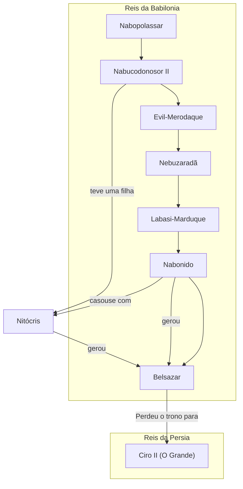

### XI Dinastia da Babilônia - (Império Neobabilônico ou Dinastia caldeia)

### Cronologia

```mermaid
gantt
    title Genealogia Reis da Babilonia
    dateFormat SSS
    axisFormat %
    section Reis da Babilonia
        Nabopolassar : 605,626
		Nabucodonosor II :r2, 562,604
		Evil-Merodaque : 560,562
		Nebuzaradã: 556,560
		Labasi-Marduque: 556,557
		Nabonido: 539,556
		Belsazar: 539,556
        
    section Reis da Media e Persia
        Ciro II :500,539

```

### Genealogia

| Rei                                                                                                                                                    | Reinado        | Comentários                                                                                                                                                                                                                                                                                                                                                                                                                                                                                      |
| ------------------------------------------------------------------------------------------------------------------------------------------------------ | -------------- | ------------------------------------------------------------------------------------------------------------------------------------------------------------------------------------------------------------------------------------------------------------------------------------------------------------------------------------------------------------------------------------------------------------------------------------------------------------------------------------------------ |
| [Nabopolassar](https://pt.wikipedia.org/wiki/Nabopolassar "Nabopolassar")                                                                              | 626 – 605 a.C. | _Rei [caldeu](https://pt.wikipedia.org/wiki/Caldeia "Caldeia"); Passou o controle da Babilônia para [Sinsariscum](https://pt.wikipedia.org/wiki/Sinsariscum "Sinsariscum") da Assíria, rumou com os exércitos assírios para a Babilônia em 616 a.C.; Celebrou uma aliança com [Ciaxares](https://pt.wikipedia.org/wiki/Ciaxares "Ciaxares") e destruiu o Império Assírio_.                                                                                                                       |
| [Nabucodonosor II](https://pt.wikipedia.org/wiki/Nabucodonosor_II "Nabucodonosor II")                                                                  | 604 – 562 a.C. | _Rei [caldeu](https://pt.wikipedia.org/wiki/Caldeia "Caldeia") e filho de [Nabopolassar](https://pt.wikipedia.org/wiki/Nabopolassar "Nabopolassar"); Derrotou os [egípcios](https://pt.wikipedia.org/wiki/Antigo_Egito "Antigo Egito"), assírios em [Carquemis](https://pt.wikipedia.org/wiki/Carquemis "Carquemis") e tomou [Jerusalém](https://pt.wikipedia.org/wiki/Jerusal%C3%A9m "Jerusalém"). É associado a [Daniel](https://pt.wikipedia.org/wiki/Daniel "Daniel") nos relatos bíblicos._ |
| [Evil-Merodaque](https://pt.wikipedia.org/wiki/Evil-Merodaque "Evil-Merodaque")                                                                        | 562 – 560 a.C. | _Filho de Nabucodonosor II; Assassinado pelo seu cunhado [Neriglissar](https://pt.wikipedia.org/wiki/Neriglissar "Neriglissar")._                                                                                                                                                                                                                                                                                                                                                                |
| [Neriglissar](https://pt.wikipedia.org/wiki/Neriglissar "Neriglissar")  ou [Nebuzaradã](https://pt.wikipedia.org/wiki/Nebuzarad%C3%A3 "Nebuzaradã") | 560 – 556 a.C. | _Usurpou o trono ao assassinar [Evil-Merodaque](https://pt.wikipedia.org/wiki/Evil-Merodaque "Evil-Merodaque")._                                                                                                                                                                                                                                                                                                                                                                                 |
| [Labasi-Marduque](https://pt.wikipedia.org/wiki/Labasi-Marduque "Labasi-Marduque")                                                                     | 556 a.C.       | _Filho de [Neriglissar](https://pt.wikipedia.org/wiki/Neriglissar "Neriglissar")._                                                                                                                                                                                                                                                                                                                                                                                                               |
| [Nabonido](https://pt.wikipedia.org/wiki/Nabonido "Nabonido")                                                                                          | 556 – 539 a.C. | _Último rei da Babilônia, teve origem em [Harã](https://pt.wikipedia.org/wiki/Har%C3%A3 "Harã") na [Assíria](https://pt.wikipedia.org/wiki/Ass%C3%ADria "Assíria"); Não era um [caldeu](https://pt.wikipedia.org/wiki/Caldeu "Caldeu"), deu regência para seu filho [Belsazar](https://pt.wikipedia.org/wiki/Belsazar "Belsazar")._                                                                                                                                                              |
| [Belsazar](https://pt.wikipedia.org/wiki/Belsazar "Belsazar")                                                                                          | 556 – 539 a.C. | _Co-regente de seu pai [Nabonido](https://pt.wikipedia.org/wiki/Nabonido "Nabonido"); Foi assassinado por [Dario, o Medo](https://pt.wikipedia.org/wiki/Dario,_o_Medo "Dario, o Medo"), que marcou o fim do [Império Neobabilônico](https://pt.wikipedia.org/wiki/Imp%C3%A9rio_Neobabil%C3%B4nico "Império Neobabilônico")._                                                                                                                                                                     |

